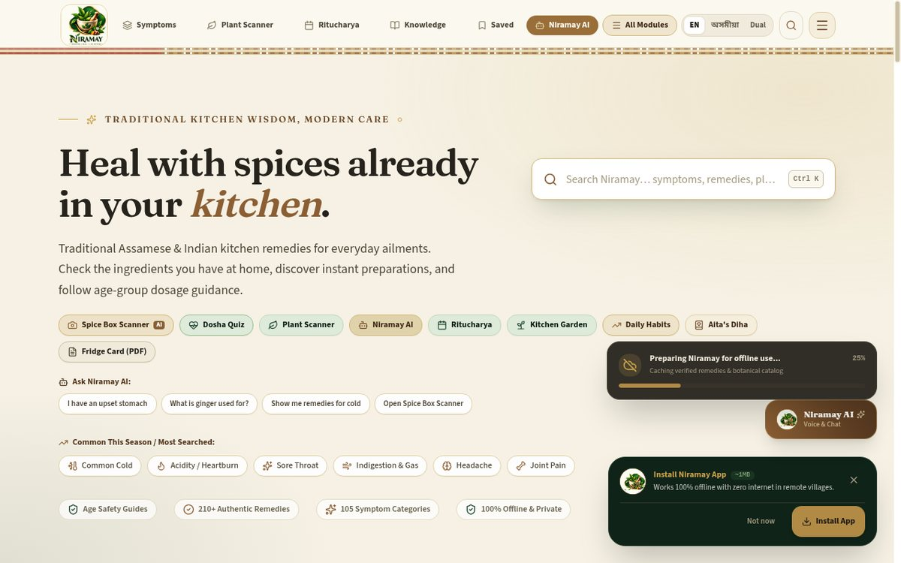
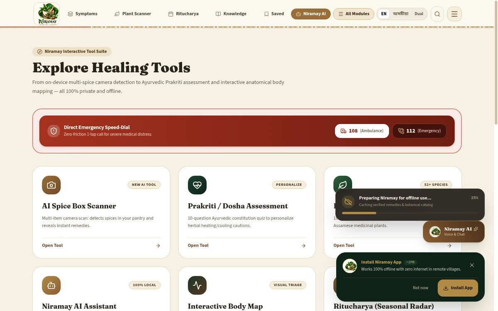
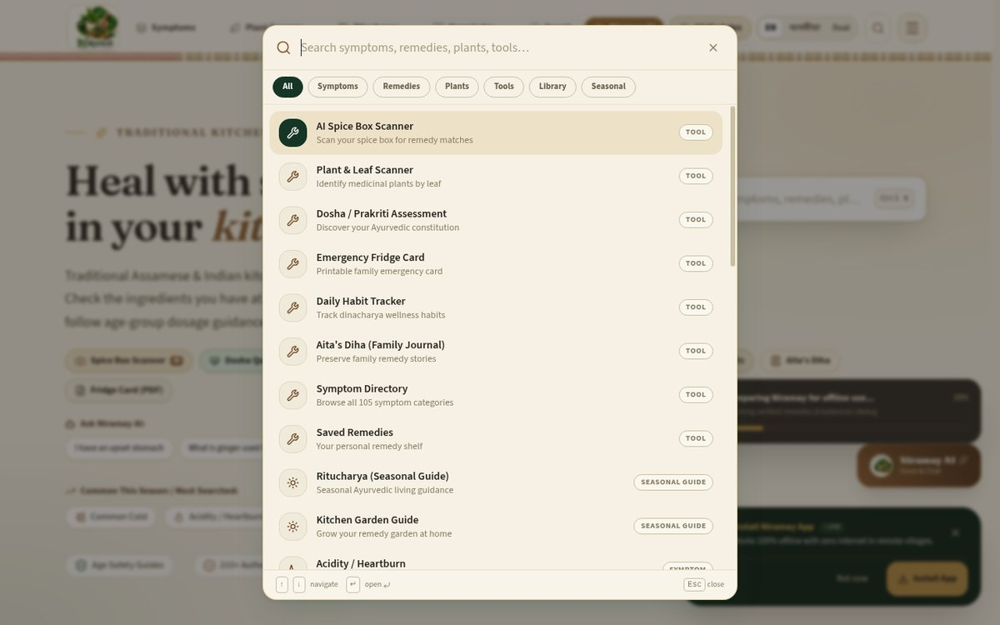
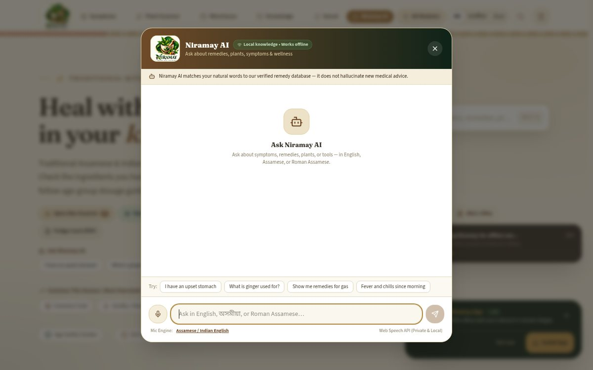
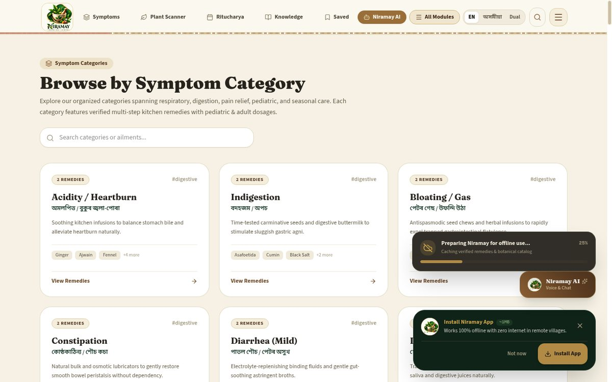
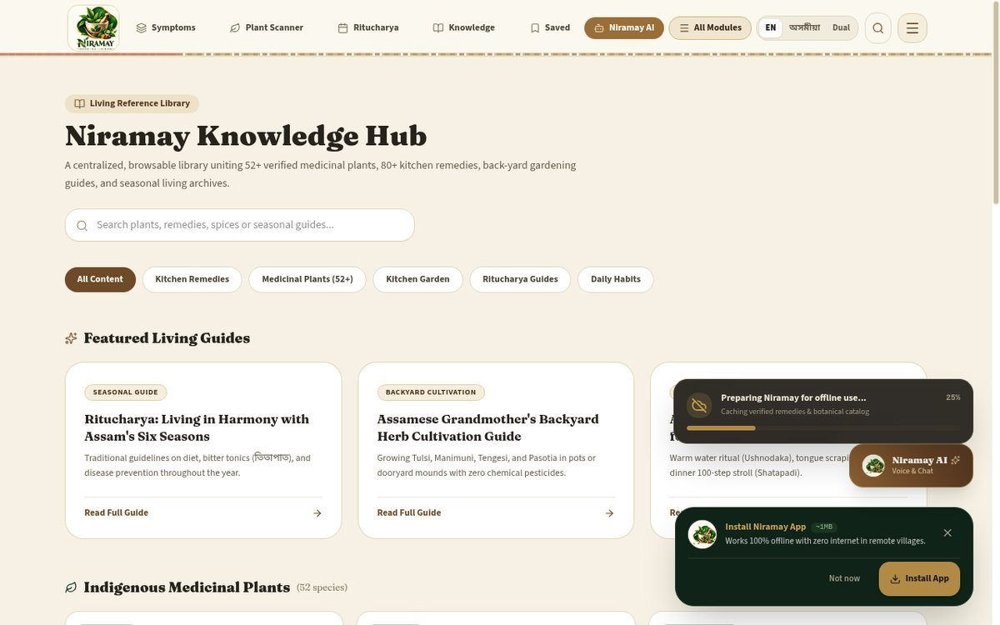
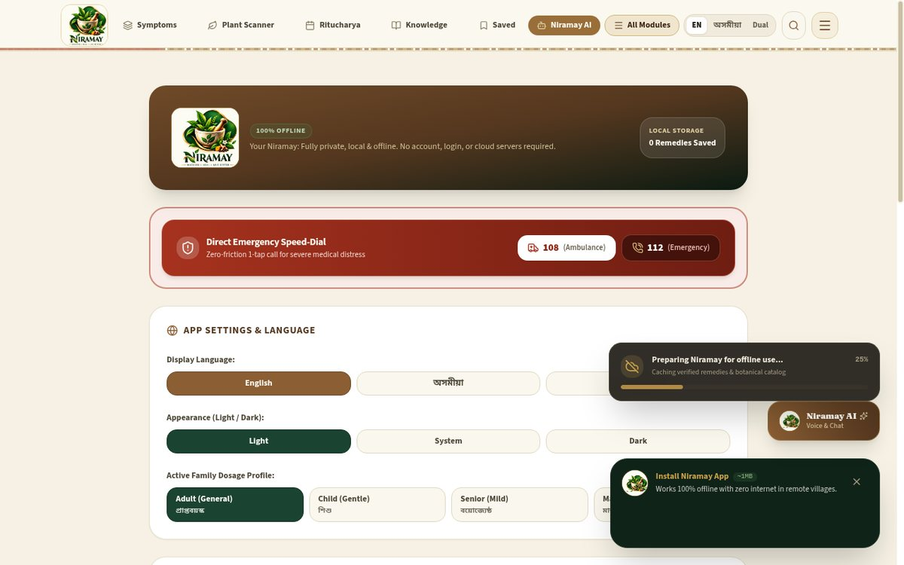

<p align="center">
  
</p>

<h1 align="center">Niramay</h1>

<p align="center"><strong>Traditional Kitchen Remedies</strong></p>

<p align="center">
  A privacy-first, offline-friendly web app for exploring traditional Assamese and Indian
  kitchen remedies, medicinal plants, seasonal living guidance, and everyday wellness knowledge —
  entirely on your device.
</p>

<p align="center">
  <a href="https://pdfly-source.github.io/niramay/"><strong>Live Demo</strong></a> ·
  <a href="https://github.com/PDFly-source/niramay/releases">Releases</a> ·
  <a href="https://github.com/PDFly-source/niramay/issues">Report an Issue</a>
</p>

<p align="center">
  <a href="https://pdfly-source.github.io/niramay/"></a>
  <a href="https://pdfly-source.github.io/niramay/manifest.webmanifest"></a>
  
  <a href="https://github.com/PDFly-source/niramay/releases"></a>
</p>

---

## ✦ What Niramay Offers

| | |
|---|---|
| 🔎 **Universal Search** | One command palette (Ctrl+K) searches remedies, symptoms, plants, and tools with typo-tolerant, phonetic matching. |
| 🌿 **Kitchen Remedies** | Traditional Assamese and Indian household remedies with ingredients, steps, and age-group dosage guidance. |
| 🌱 **Medicinal Plant Library** | A browsable knowledge bank of medicinal plants with traditional uses and cautions. |
| 🧭 **Interactive Wellness Tools** | Spice scanner, plant scanner, dosha assessment, Ritucharya seasonal guidance, daily habits, fridge remedy card. |
| 🤖 **Local AI Assistant** | An intent engine that understands your question — running 100% in your browser, no server, no AI cloud calls. |
| 🗣 **Trilingual Interface** | English · অসমীয়া · Roman Assamese — including voice input where your browser supports it. |
| 🚨 **Safety-First Guidance** | Severe-symptom red-flag cues and ingredient cautions are surfaced before any remedy content. |
| 📱 **Installable PWA** | Add Niramay to your home screen and use it offline. |
| 🌙 **Light & Dark Mode** | Parchment daylight and ink-green night themes. |
| 🔒 **Local-First** | No account, no login, no tracking. Your data stays in your browser. |

## Screenshots

| Home | Explore |
|---|---|
|  |  |

| Command Palette | AI Assistant |
|---|---|
|  |  |

| Categories | Knowledge Library | Menu |
|---|---|---|
|  |  |  |

## Why Niramay?

- **Rooted in Assamese culture.** Remedies are written for Assamese households first — the interface, search, and AI assistant all understand অসমীয়া and Roman Assamese, not just English.
- **Designed for everyday access.** A kitchen-shelf approach: find a remedy, check an ingredient, follow a step — in under a minute, on a low-end phone.
- **Local-first philosophy.** Everything runs in the browser. No accounts, no cloud database, no analytics.
- **Traditional knowledge, organized.** Scattered household wisdom — kadhas, spice pastes, seasonal routines — presented as a structured, searchable reference.
- **Safety-first interaction design.** Educational content is clearly separated from emergency guidance; severe-symptom cues always take priority.

## How It Works

```text
        User
         │
         ▼
  Niramay Web App (Next.js static export)
         │
         ▼
  Local search · knowledge engine · intent matching
  (runs entirely in the browser)
         │
         ▼
  Browser storage (localStorage) · PWA offline cache
```

Niramay is a fully static web app. There is **no backend server, no database, and no external AI service**. Search, the AI assistant, and all tools run locally in your browser; preferences and saved items are stored in `localStorage`; the PWA cache serves the app offline.

## Privacy by Design

- **No account or login.** Nothing to sign up for.
- **No cloud database.** All remedy and plant content ships inside the app.
- **No analytics or tracking.** The app makes no telemetry calls.
- **Browser storage only.** Saved remedies, preferences, and logs live in your browser's `localStorage`. Clearing site data removes them permanently.
- **Voice input is optional.** If you use voice, your browser's speech-recognition API requires microphone permission; you can decline and type instead. (Speech support depends on your browser.)
- **Offline by default.** After the first visit, the PWA serves from cache.

## Using Niramay

You are free to:

- visit the [live web application](https://pdfly-source.github.io/niramay/);
- use its available features for their intended personal and educational purposes;
- install Niramay as a PWA where your browser supports it.

Using the deployed application does **not** grant ownership of, or any
source-code reuse rights in, the project. A public GitHub repository is not
the same thing as free source code — see [License](#license) and
[REUSE_POLICY.md](REUSE_POLICY.md).

## Important Safety Notice

> **Niramay provides educational information about traditional household practices and wellness knowledge. It is not a substitute for diagnosis, treatment, or professional medical advice.**
>
> - In an emergency, contact your local emergency services immediately.
> - Seek professional medical advice for severe, persistent, or worsening symptoms — the app will remind you of the same.
> - Age-group dosage guidance is general educational information, never personalized medical advice.
> - Traditional practices are cultural knowledge, not clinically verified treatments.

## Built With

- [Next.js](https://nextjs.org) (static export) · [React](https://react.dev) · [TypeScript](https://www.typescriptlang.org)
- [Tailwind CSS](https://tailwindcss.com) · [Framer Motion](https://motion.dev) · [lucide-react](https://lucide.dev)
- [Zustand](https://zustand.docs.pmnd.rs) (local state) · [Fuse.js](https://fusejs.io) (fuzzy search) · [Zod](https://zod.dev)
- PWA (custom service worker) · deployed on [GitHub Pages](https://pages.github.com)

## Run Locally

```bash
git clone https://github.com/PDFly-source/niramay.git
cd niramay
npm install
npm run dev
```

Then open the printed local URL (development serves at the site root).

For a production build with the `/niramay` base path used by GitHub Pages:

```bash
NEXT_PUBLIC_BASE_PATH=/niramay npm run build
npx serve out
```

### Install as a PWA

Visit the [live app](https://pdfly-source.github.io/niramay/) in a supported browser and choose **Install app** / **Add to Home Screen** from the browser menu. Niramay then works offline like a native app.

## Development

| Command | Purpose |
|---|---|
| `npm run dev` | Development server |
| `npm run build` | Production static build (includes type checking) |
| `npm run lint` | ESLint |
| `npm run test:ai` | AI engine test suite (115 checks) |

## Project Status

**Current release:** Niramay 2.1.0 — Public Release

| Check | Status |
|---|---|
| TypeScript | PASS |
| Production build | PASS |
| AI engine tests | 115/115 PASS |
| Browser QA (navigation, search, AI, dark mode, responsive) | PASS |
| Physical device QA | Not yet performed |

## Roadmap

### Completed
- [x] Core wellness knowledge experience (remedies, plants, categories, symptoms)
- [x] Multilingual search — English / অসমীয়া / Roman Assamese
- [x] Universal command palette (Ctrl+K)
- [x] Local AI assistant with safety-first red-flag handling
- [x] Installable PWA with offline support
- [x] Official Niramay visual identity, light & dark mode
- [x] Responsive mobile-first UX
- [x] Interactive wellness tools (dosha, Ritucharya, scanners, habits)

### Planned
- [ ] Physical-device QA pass (voice input, Android keyboard behavior)
- [ ] More medicinal plants and regional remedy variations
- [ ] Deeper offline ingredient-scanner guidance
- [ ] Print-friendly remedy formats

## Contributing

Niramay is not an open-source project, so this section is not a call for code
reuse. Suggestions and issue reports are welcome via the
[issue tracker](https://github.com/PDFly-source/niramay/issues). Any
contribution that might be accepted would require explicit permission and
terms from the project owner — opening an issue does not grant source-code
reuse rights. Please keep reports factual and include steps to reproduce.

## License

Niramay is **not an open-source project**. Its original source code and
original project assets are proprietary and remain under the control of the
project owner, as stated in [LICENSE.md](LICENSE.md).

The repository is publicly viewable, but public visibility does not grant
permission to copy, modify, redistribute, repackage, sublicense, or
commercially reuse the Niramay source code. Niramay is available for use
through the official deployed web application; third-party dependencies and
assets remain subject to their respective licenses (see
[THIRD_PARTY_NOTICES.md](THIRD_PARTY_NOTICES.md)).

## Credits

- The traditional Assamese and Indian household knowledge this app organizes, carried by generations of home practitioners.
- Built with open-source tools: Next.js, React, Tailwind CSS, Framer Motion, Zustand, and Fuse.js.

---

**Niramay** · Traditional Kitchen Remedies

*Built with care for everyday learning and exploration.*

[Live Demo](https://pdfly-source.github.io/niramay/) · [GitHub](https://github.com/PDFly-source/niramay) · [Releases](https://github.com/PDFly-source/niramay/releases) · [Issues](https://github.com/PDFly-source/niramay/issues)
